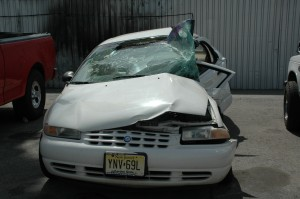
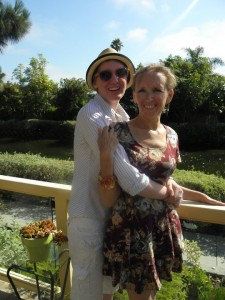

##My Story

Meet Shavonne O’Loughlin. She is 22 years old, and she was in a terrible car accident on March 1, 2011. She sustained severe injuries to her body and brain and was in a coma for over 2 months, during which time she was resuscitated 10 times. This is her story of Recovery. After waking up with total amnesia and the inability to move even a finger at will, she has made huge strides to regaining her life and her former self back. She is learning to talk, read, and walk again with a titanium steel rod implanted in her femur and pins in her broken hip. It is going to take a lot of hard work on her part to recover and that means intense physical therapy, a very long hospital stay, and years of continued outside rehabilitative therapy.

The doctors say that, after medical attention, the most important part of her recovery will be the continuous and constant interaction and support of her friends and family, who have been by her side daily from Cedars Sinai to Colorado Springs keeping her spirits up and encouraging her daily progress. With the intensive love and support of her Community, we have great faith that she will make a full recovery.

What can you do to help Shavonne? You can help by tracking her progress, sending love and support her way, and most of all, you can help by Donating. Every little bit counts, and she needs it to make sure that she can keep receiving the best medical and occupational care. Her recovery is going to be a long one before she is back to herself again and able to function independently, including performing a full-time job with full wages. Please help her and her family to afford all of the things that she needs to keep getting stronger, and Thank You for your continued love and generosity.  

Check out her [gallery](./gallery) for pictures and videos!

